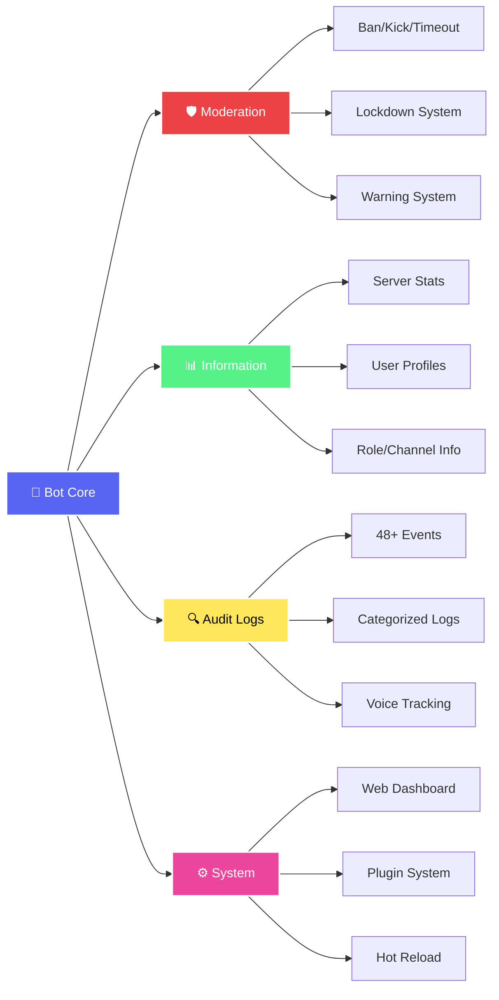

<div align="center">

<!-- Animated Banner -->


<br/>

<!-- Typing Animation for subtitle -->
<p align="center">
  
</p>

<!-- Badges with animations -->
<p align="center">
  <a href="https://nodejs.org/">
    
  </a>
  <a href="https://discord.js.org/">
    
  </a>
  <a href="LICENSE">
    
  </a>
</p>

<p align="center">
  
  
  
  
</p>

<!-- Divider with gradient -->


<!-- Note with animated box -->
<table>
<tr>
<td>

### 💡 Project Origins & Credits

> **Important:** This project is heavily inspired by and builds upon the amazing work of **[Tomato (Milrato)](https://github.com/Tomcat-SL)** and their **[Milrato Discord Bot](https://github.com/Tomcat-SL/Milrato-Discord-Bot)** project.
>
> While Milrato's bot is no longer actively maintained, it served as the foundation and inspiration for many of the architectural decisions, features, and design patterns used in this project. This bot would not exist without Tomato's pioneering work in the Discord bot development space.
>
> **All credit for the original concepts, structure, and innovation goes to Tomato/Milrato.** 🙏

</td>
</tr>
</table>


</div>

## ✨ Features

<!-- Features with animated icons -->
<div align="center">



</div>

<table>
<tr>
<td width="50%">

### 🛡️ Moderation

- ⚔️ Ban, kick, timeout, warn users
- 🔒 Emergency server lockdown
- 🗑️ Bulk message deletion
- 💥 Channel nuking
- ⚖️ Configurable warning system

</td>
<td width="50%">

### 📊 Information

- 📈 Server statistics
- 👤 User profiles & badges
- 🎭 Role & channel details
- 🖼️ Avatar & banner viewer
- 📖 Interactive help menu

</td>
</tr>
<tr>
<td width="50%">

### 🔍 Audit Logging

- 📝 48+ tracked Discord events
- 📂 Organized by categories
- 💬 Message, member, server changes
- 🔊 Voice state tracking
- 🔨 Moderation actions

</td>
<td width="50%">

### ⚙️ System

- 🌐 Web dashboard on port 3000
- 🔌 Plugin architecture
- 🔥 Hot-reload support
- 📊 Metrics endpoint
- 💾 Crash reporting

</td>
</tr>
</table>

## 🚀 Quick Start

### Prerequisites

- Node.js 18.17 or higher
- Discord bot token from the [Developer Portal](https://discord.com/developers/applications)

### Installation

**1. Clone and install**

```bash
git clone <repository-url>
cd discord-bot
npm install
```

**2. Configure environment**

Create a `.env` file:

```bash
DISCORD_TOKEN=your_bot_token_here
DISCORD_CLIENT_ID=your_application_id
GUILD_ID=your_server_id  # optional - for faster testing
```

**3. Register commands**

```bash
npm run register
```

**4. Start the bot**

```bash
npm run dev   # development with auto-restart
npm start     # production
```

The bot will be online and dashboard available at `http://localhost:3000`

## ⚙️ Configuration

### Environment Variables

| Variable            | Required | Description                                  |
| ------------------- | -------- | -------------------------------------------- |
| `DISCORD_TOKEN`     | ✅       | Your bot token                               |
| `DISCORD_CLIENT_ID` | ✅       | Your application ID                          |
| `GUILD_ID`          | ❌       | Server ID for instant command updates        |
| `OWNERS`            | ❌       | User IDs who can use owner-only commands     |
| `PORT`              | ❌       | Port for the web dashboard (default: 3000)   |
| `LOG_LEVEL`         | ❌       | How much to log: debug, info, warn, error    |
| `METRICS_ENABLED`   | ❌       | Turn on the /metrics endpoint (default: off) |

> **💡 Tip:** Set `GUILD_ID` during development for instant command updates. Remove it for production to deploy commands globally (takes up to 1 hour).

## 📁 Project Structure

```
discord-bot/
├── src/
│   ├── commands/      # slash commands by category
│   ├── components/    # button, menu, and modal handlers
│   ├── context/       # right-click context menus
│   ├── events/        # discord event listeners
│   ├── handlers/      # core interaction routing
│   ├── runtime/       # background services & plugins
│   └── util/          # helper functions
├── config/            # json configuration files
├── plugins/           # optional plugin modules
└── scripts/           # utility scripts
```

## 📋 Commands

### 🔧 Admin

| Command       | Description                    |
| ------------- | ------------------------------ |
| `/announce`   | Send announcements with embeds |
| `/audit`      | Setup audit logging            |
| `/verify`     | Setup verification system      |
| `/warn-setup` | Configure warnings             |

### 🛡️ Moderation

| Command     | Description                      |
| ----------- | -------------------------------- |
| `/ban`      | Ban a user                       |
| `/kick`     | Kick a user                      |
| `/lockdown` | Lock all channels at once        |
| `/unlock`   | Unlock channels                  |
| `/nuke`     | Delete all messages in a channel |
| `/purge`    | Bulk delete messages             |
| `/timeout`  | Timeout a user                   |
| `/warn`     | Warn a user                      |

### ℹ️ Information

| Command        | Description       |
| -------------- | ----------------- |
| `/avatar`      | Show user avatars |
| `/banner`      | Show user banners |
| `/serverinfo`  | Server stats      |
| `/userinfo`    | User details      |
| `/roleinfo`    | Role details      |
| `/channelinfo` | Channel info      |
| `/help`        | List commands     |

### 🎲 Fun

| Command     | Description |
| ----------- | ----------- |
| `/coinflip` | Flip a coin |
| `/dice`     | Roll dice   |

## 🔌 Adding Commands

Create a new file in `src/commands/{category}/`:

```javascript
// src/commands/fun/example.js
import { SlashCommandBuilder } from 'discord.js';

export default {
  data: new SlashCommandBuilder().setName('example').setDescription('Does something cool'),

  category: 'fun',

  async execute(interaction) {
    await interaction.reply('Hello!');
  },
};
```

Register and restart:

```bash
npm run register  # register new command
npm run dev       # restart bot
```

## 🎨 Development

### Code Quality

```bash
npm run lint         # check for issues
npm run lint:fix     # auto-fix issues
npm run format       # format with prettier
npm run format:check # check formatting
```

### Web Dashboard

Access at `http://localhost:3000` to view:

- Bot status and uptime
- Command list
- Server count
- Memory usage
- `/metrics` endpoint (requires `METRICS_ENABLED=true`)

## 🧩 Plugins

Extend functionality without modifying core code:

```javascript
// plugins/example/index.js
export default {
  name: 'example-plugin',
  init(api) {
    api.on('ready', () => {
      console.log('Plugin loaded');
    });
  },
};
```

Plugins load automatically on startup.

## 🔒 Security

- ⚠️ Never commit your `.env` file
- 🔑 Keep your bot token secret
- 🔍 Run `npm audit` regularly
- 📦 Keep dependencies updated with `npm update`

## 📄 License

MIT License - See [LICENSE](LICENSE) file for details

## 🙏 Acknowledgments & Credits

<div align="center">

### Special Thanks to Tomato (Milrato) 🎖️

<table>
<tr>
<td align="center" width="100%">

This entire project is based on the incredible work of **[Tomato (Milrato)](https://github.com/Tomcat-SL)**.

The **[Milrato Discord Bot](https://github.com/Tomcat-SL/Milrato-Discord-Bot)** project was a groundbreaking, feature-rich Discord bot that set the standard for modular bot architecture. Although it's no longer actively maintained, it remains one of the most influential Discord bot projects in the community.

**What we adapted from Milrato:**
- 🏗️ Modular command and event architecture
- 🎨 UI/UX design patterns and embed styling  
- 🔧 Advanced moderation systems
- 📊 Audit logging structure
- ⚙️ Plugin system concepts
- 🛠️ Overall project organization

**This project would not exist without Tomato's vision, innovation, and contributions to the Discord bot development community.**

Thank you, Tomato! 🙏❤️

🔗 **Original Project:** [Milrato Discord Bot](https://github.com/Tomcat-SL/Milrato-Discord-Bot)  
👤 **Creator:** [Tomato/Tomcat-SL](https://github.com/Tomcat-SL)

</td>
</tr>
</table>

</div>

---

<div align="center">

<!-- Animated divider -->


### 📊 Repository Stats

<p align="center">
  
  
</p>

<!-- Language Stats -->
<p align="center">
  
</p>


<!-- Activity Graph -->


### 🛠️ Built With

<p align="center">
  
</p>


<!-- Made with love badge -->


<!-- Wave Footer -->


</div>
